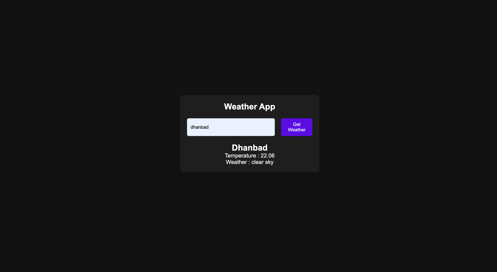

# 🌦️ Weatherly

A clean and responsive weather application that provides real-time weather updates using a public weather API, with graceful handling of invalid city or country inputs.

---

## 🚀 Features

- 🌍 Search weather by city name
- ⏱️ Real-time weather data
- 🌡️ Temperature in Celsius
- 📝 Weather condition description
- ❌ User-friendly error message for invalid locations
- 📱 Fully responsive design
- 🧼 Clean and minimal UI

---

## 🛠️ Tech Stack

- **HTML5** – Structure
- **CSS3** – Styling & layout
- **JavaScript (ES6+)** – Logic & API handling
- **OpenWeatherMap API** – Live weather data

---

## ⚙️ How It Works

1. User enters a city name
2. App sends a request to the OpenWeatherMap API
3. If the city exists:
   - Weather details are displayed
4. If the city does not exist:
   - A user-friendly error message is shown
   - Weather information is hidden

---

## 🧪 Error Handling

- Handles invalid city or country names
- Prevents displaying stale or incorrect weather data
- Graceful UI state switching using CSS class toggling

---

## 🖼️ Preview

✍️ **Maintained by [Gaurav Ambasta](https://github.com/GauravAmbasta2405)**
